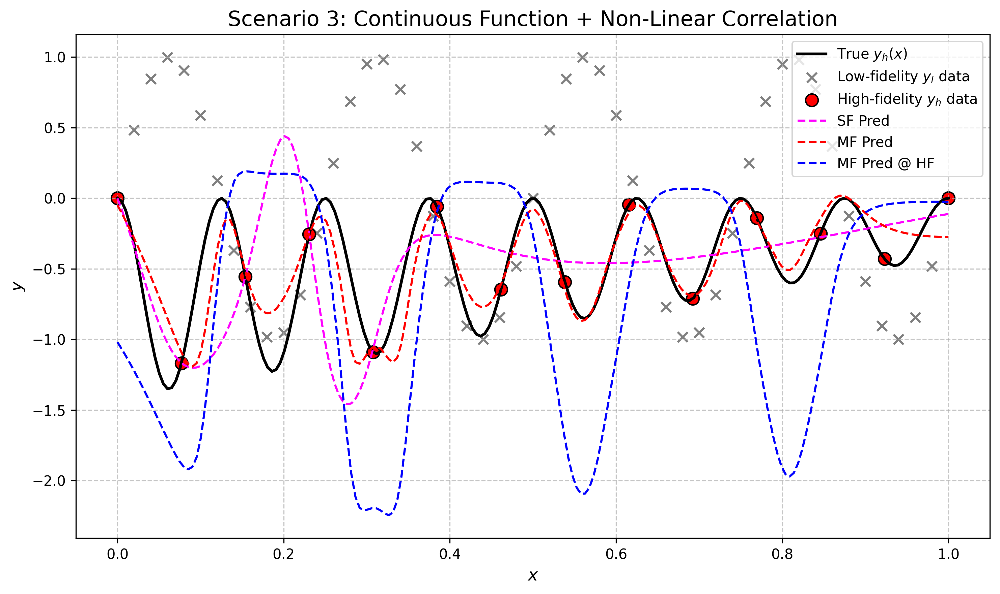
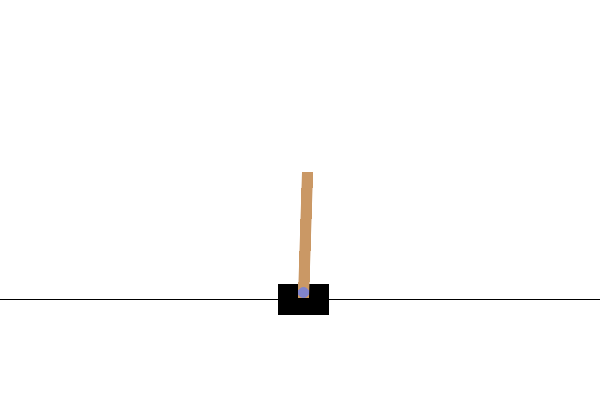

# Simulation Intelligence and Learning for Autonomous Systems (SILAS) - UniTS 2024/2025

This repository contains the projects and code implementations for the Simulation Intelligence and Learning for Autonomous Systems (SILAS) course at the University of Trieste (UniTS) for the academic year 2024-2025.

The course was divided into two main parts:

1. **Simulation Intelligence**: Explored the application of AI in simulations, focusing on Scientific Machine Learning.
2. **Learning for Autonomous Systems**: Covered the use of system models for control, within the frameworks of optimal control and reinforcement learning for dynamical systems.

The final exam involved presenting two research papers. This repository includes links to the presentation slides and basic Python implementations of the algorithms discussed in these papers, developed to demonstrate understanding of the core concepts.

## Projects Overview

### 1. Simulation Intelligence Project

This project focused on the paper "A composite neural network that learns from multi-fidelity data: Application to function approximation and inverse PDE problems" by Meng and Karniadakis (2019). The paper introduces a composite neural network architecture capable of learning from both high-fidelity and low-fidelity data, a technique highly relevant in scientific computing and simulation.

**Presentation Slides**: 📑 [View Slides](https://docs.google.com/presentation/d/12BtFf2grsCVFt1wgeKgkXGIyau0fKYW5V-64UWhqUhM/edit?usp=sharing)

**Example Result**:


### 2. Learning for Autonomous Systems Project

This project investigated "Proximal Policy Optimization Algorithms" by Schulman et al. (2017). Proximal Policy Optimization (PPO) is a reinforcement learning algorithm known for its stability and efficiency in balancing exploration and exploitation.

A simple implementation of PPO was developed using the "CartPole-v1" environment from Gymnasium.

**CartPole-v1 PPO Animation**:


**Presentation Slides**: 📑 [View Slides](https://drive.google.com/file/d/1vtIUTuCs5o6901DGPyU0qAqjQ4VAZDLk/view?usp=sharing)

## How to Run the Code

This project is implemented in Python and uses `uv` for environment and package management. Follow these steps to set up and run the code:

1. **Clone the Repository**:

   ```bash
   git clone <repository-url> # Replace <repository-url> with the actual URL
   cd <repository-name> # Replace <repository-name> with the cloned directory name
   ```

2. **Install `uv`**:

   If you don't have `uv` installed, you can install it via pip:

   ```bash
   pip install uv
   ```

   For other installation methods, refer to the [official `uv` documentation](https://github.com/astral-sh/uv).

3. **Set Up the Python Environment with `uv`**:

   `uv` simplifies environment creation and dependency management. Navigate to the project's root directory (where `pyproject.toml` is located) and run:

   ```bash
   uv sync
   ```

   This command performs two key actions:
   * It creates a local virtual environment (typically in a `.venv` folder in the project root).
   * It installs all dependencies specified in the `pyproject.toml` file into this environment, ensuring a consistent setup.

4. **Activate the Virtual Environment**:

   To use the project's dependencies, you need to activate the `uv`-managed environment.

   * **Linux or macOS**:

     ```bash
     source .venv/bin/activate
     ```

   * **Windows (Command Prompt or PowerShell)**:

     ```bash
     .venv\Scripts\activate
     ```

   You should see the virtual environment's name (e.g., `(.venv)`) in your shell prompt, indicating it's active.

5. **Running the Code**:

   Once the environment is activated, you can run the Python scripts located in the respective project folders:
   * `SimulationIntelligence/`
   * `Learning4AutonomousSystems/`

   For example, to run a script within the `Learning4AutonomousSystems` folder:

   ```bash
   python Learning4AutonomousSystems/main.py
   ```

   Refer to the individual project folders for specific instructions if available.

**Note on Package Managers**: While `uv` is the recommended package manager for this project (as defined in `pyproject.toml`), you can adapt the setup for other managers like `conda` or `pip` with `venv` if you prefer. However, `uv sync` provides a streamlined way to replicate the development environment.

## References

* Meng, X., & Karniadakis, G. E. (2019). A composite neural network that learns from multi-fidelity data: Application to function approximation and inverse PDE problems. Journal of Computational Physics, 396, 1-20. [Link to paper](https://doi.org/10.1016/j.jcp.2019.05.001)
* Schulman, J., Wolski, F., Dhariwal, P., Radford, A., & Klimov, O. (2017). Proximal Policy Optimization Algorithms. arXiv preprint arXiv:1707.06347. [Link to paper](https://arxiv.org/abs/1707.06347)
* OpenAI. (2023). Spinning Up - Proximal Policy Optimization (PPO). Retrieved from [OpenAI Spinning Up](https://spinningup.openai.com/en/latest/algorithms/ppo.html)
* Lehmann, M. (2024). The Definitive Guide to Policy Gradients in Deep Reinforcement Learning: Theory, Algorithms and Implementations. arXiv preprint arXiv:2401.13662. [Link to paper](https://arxiv.org/abs/2401.13662)
* Schulman, J., Levine, S., Moritz, P., Jordan, M. I., & Abbeel, P. (2017). Trust Region Policy Optimization. arXiv preprint arXiv:1502.05477. [Link to paper](https://arxiv.org/abs/1502.05477)
* OpenAI. (2023). Spinning Up - Trust Region Policy Optimization (TRPO). Retrieved from [OpenAI Spinning Up](https://spinningup.openai.com/en/latest/algorithms/trpo.html#background)
* Weng, L. (2018). Policy Gradient Algorithms. Retrieved from [Lilian Weng's Blog](https://lilianweng.github.io/posts/2018-04-08-policy-gradient/)